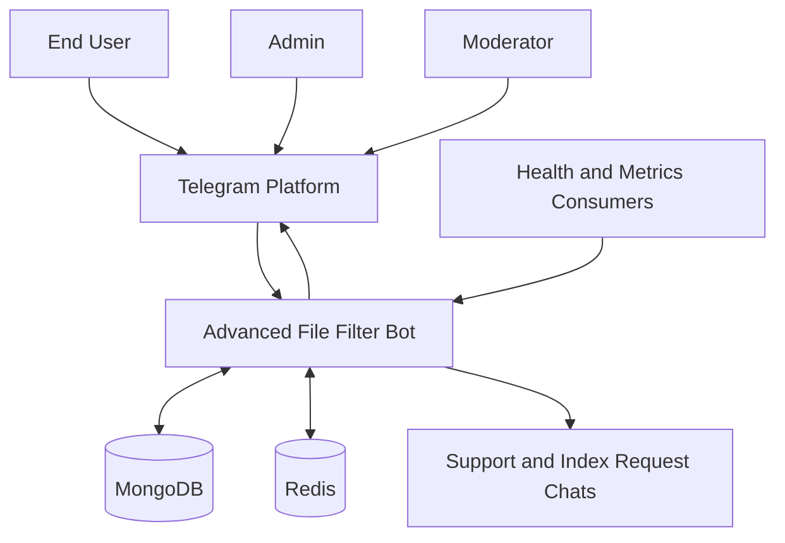
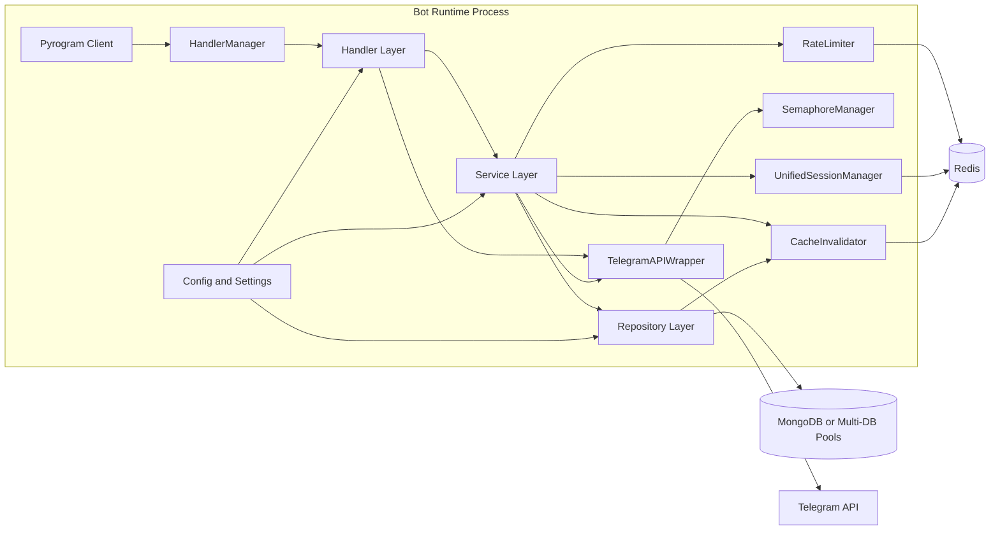
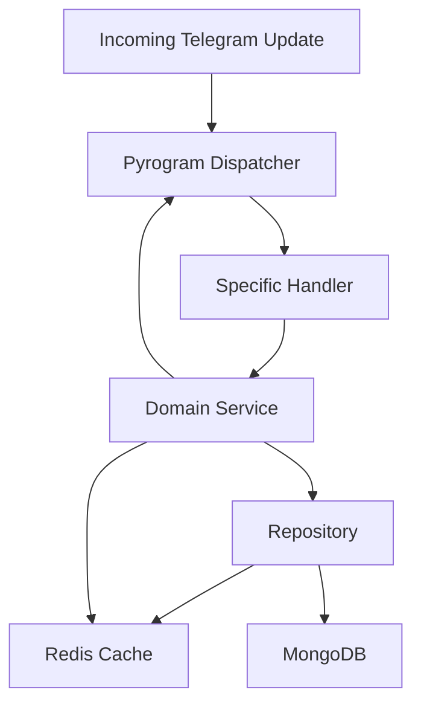
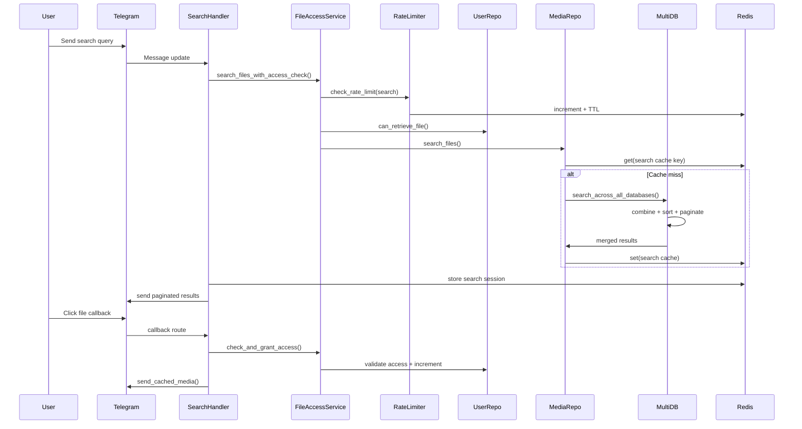
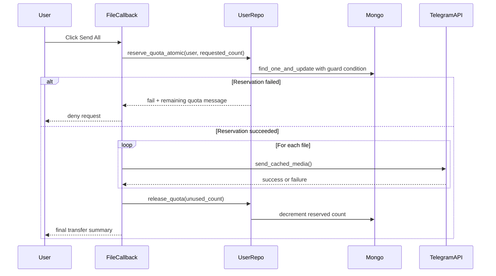
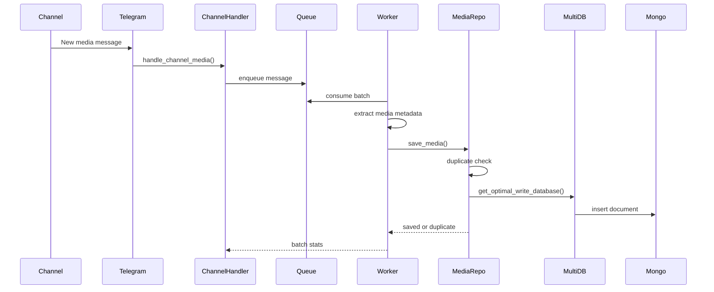
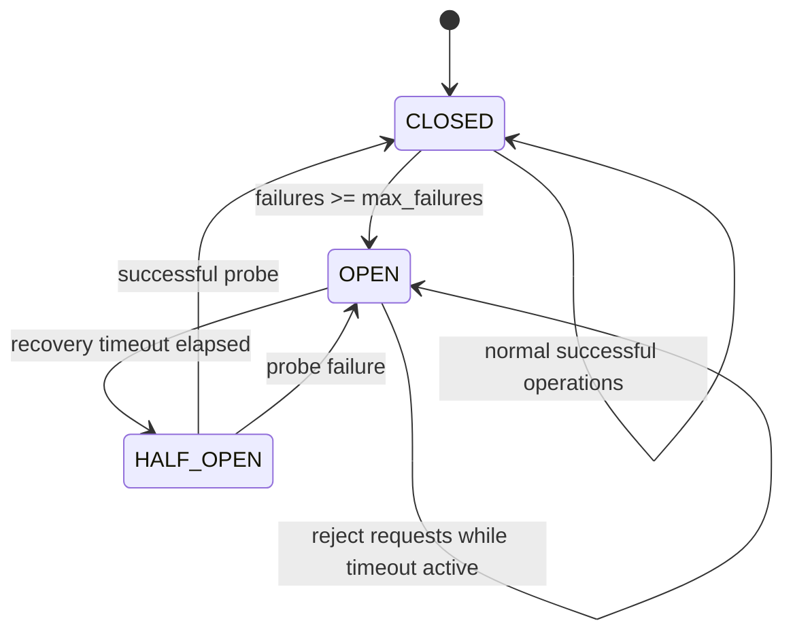
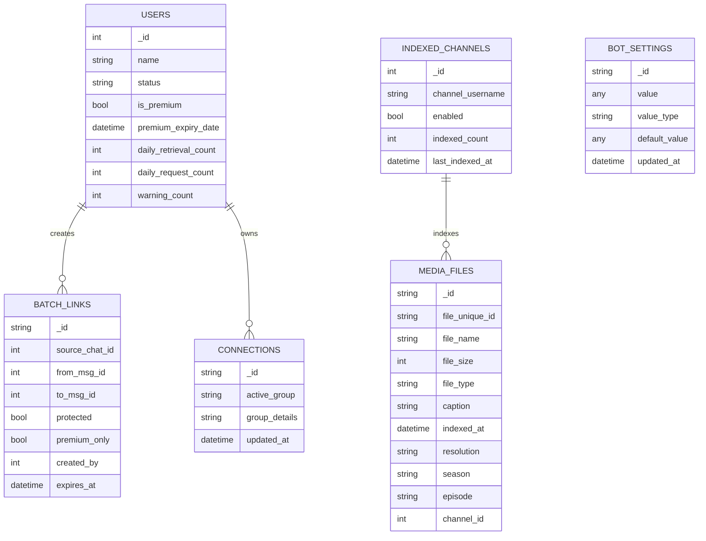
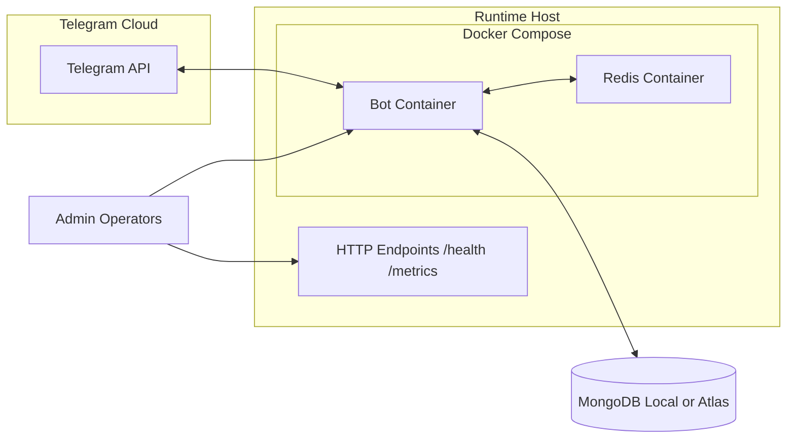

# Architecture Diagrams

This document captures the full architecture views for the Advanced File Filter Bot.

## 1. System Context

## 2. Runtime Container View

## 3. Component Interaction Flow

## 4. Search and File Delivery Sequence

## 5. Send-All Flow With Atomic Quota Reservation

## 6. Channel Auto-Indexing Pipeline

## 7. Multi-Database Circuit Breaker State Model

## 8. Data Model (Core Collections)

## 9. Deployment Topology (Docker-Oriented)

## Notes

- Diagrams are derived directly from the current code structure in `bot.py`, `core/*`, `handlers/*`, and `repositories/*`.
- For portfolio presentation, you can reuse these diagrams as-is in case studies or interview walk-throughs.
