# Architecture Diagrams

These diagrams describe the current wzgram-based Advanced File Filter Bot. They are derived from `bot.py`, `config/`, `handlers/`, `core/`, and `repositories/` and should be updated whenever runtime wiring, persistence ownership, or request flows change.

> The project installs `wzgram` but uses its Pyrogram-compatible `pyrogram` import namespace. Labels below use **wzgram client** to describe the installed runtime, not the legacy upstream Pyrogram package.

## 1. System context

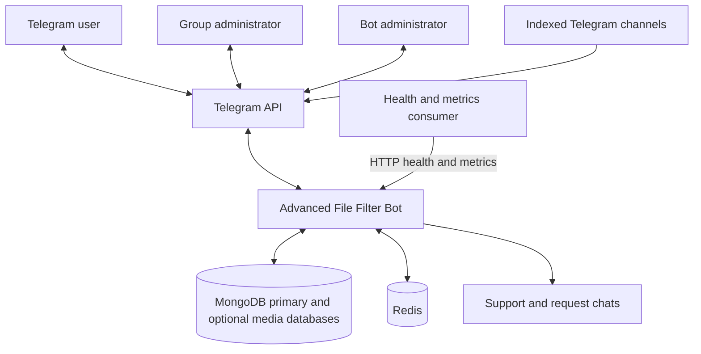
```mermaid
flowchart TB
    User[Telegram user]
    GroupAdmin[Group administrator]
    BotAdmin[Bot administrator]
    Source[Indexed Telegram channels]
    Telegram[Telegram API]
    Bot[Advanced File Filter Bot]
    Mongo[(MongoDB primary and optional media databases)]
    Redis[(Redis)]
    Health[Health and metrics consumer]
    Support[Support and request chats]

    User <--> Telegram
    GroupAdmin <--> Telegram
    BotAdmin <--> Telegram
    Source --> Telegram
    Telegram <--> Bot
    Bot <--> Mongo
    Bot <--> Redis
    Bot --> Support
    Health -->|HTTP health and metrics| Bot
```

MongoDB is the authoritative store for users, media, settings, filters, links, channels, and opt-in feature data. Redis owns temporary/cache-oriented state such as cached entities, search pages, interaction sessions, rate limits, search history, and recommendation signals.

## 2. Startup and dependency wiring

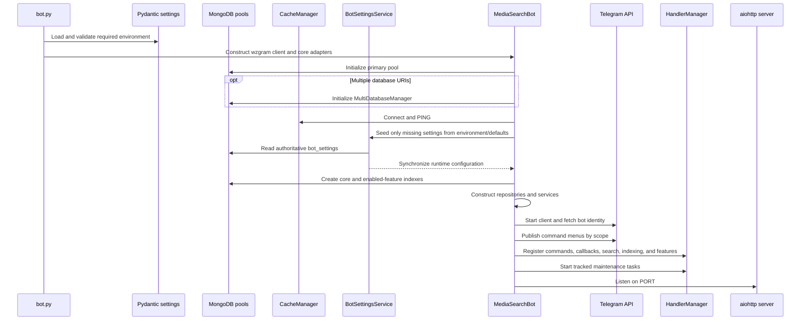
```mermaid
sequenceDiagram
    participant Entry as bot.py
    participant Config as Pydantic settings
    participant Mongo as MongoDB pools
    participant Redis as CacheManager
    participant Settings as BotSettingsService
    participant App as MediaSearchBot
    participant TG as Telegram API
    participant Handlers as HandlerManager
    participant Web as aiohttp server

    Entry->>Config: Load and validate required environment
    Entry->>App: Construct wzgram client and core adapters
    App->>Mongo: Initialize primary pool
    opt Multiple database URIs
        App->>Mongo: Initialize MultiDatabaseManager
    end
    App->>Redis: Connect and PING
    App->>Settings: Seed only missing settings from environment/defaults
    Settings->>Mongo: Read authoritative bot_settings
    Settings-->>App: Synchronize runtime configuration
    App->>Mongo: Create core and enabled-feature indexes
    App->>App: Construct repositories and services
    App->>TG: Start client and fetch bot identity
    App->>TG: Publish command menus by scope
    App->>Handlers: Register commands, callbacks, search, indexing, and features
    App->>Handlers: Start tracked maintenance tasks
    App->>Web: Listen on PORT
```

Connection parameters must be valid before database-backed settings can be loaded. Settings stored in `bot_settings` are synchronized after the database and Redis connections are established.

## 3. Runtime container view

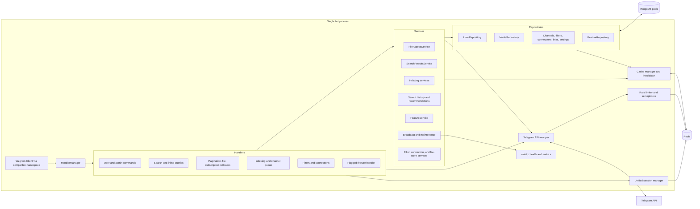
```mermaid
flowchart LR
    subgraph Process[Single bot process]
        Client[Wzgram Client via compatible namespace]
        HM[HandlerManager]

        subgraph HandlerLayer[Handlers]
            Commands[User and admin commands]
            Search[Search and inline queries]
            Callbacks[Pagination, file, subscription callbacks]
            IndexHandlers[Indexing and channel queue]
            Filters[Filters and connections]
            Features[Flagged feature handler]
        end

        subgraph ServiceLayer[Services]
            Access[FileAccessService]
            Results[SearchResultsService]
            Indexing[Indexing services]
            Recs[Search history and recommendations]
            Optional[FeatureService]
            Ops[Broadcast and maintenance]
            Store[Filter, connection, and file-store services]
        end

        subgraph RepositoryLayer[Repositories]
            Users[UserRepository]
            Media[MediaRepository]
            Control[Channels, filters, connections, links, settings]
            FeatureRepo[FeatureRepository]
        end

        API[Telegram API wrapper]
        Limits[Rate limiter and semaphores]
        Sessions[Unified session manager]
        Cache[Cache manager and invalidator]
        HTTP[aiohttp health and metrics]
    end

    Telegram[Telegram API]
    Redis[(Redis)]
    Mongo[(MongoDB pools)]

    Client --> HM
    HM --> HandlerLayer
    HandlerLayer --> ServiceLayer
    ServiceLayer --> RepositoryLayer
    HandlerLayer --> API
    ServiceLayer --> API
    API --> Limits
    API <--> Telegram
    RepositoryLayer <--> Mongo
    HandlerLayer --> Sessions
    ServiceLayer --> Cache
    RepositoryLayer --> Cache
    Limits --> Redis
    Sessions --> Redis
    Cache <--> Redis
    Ops --> HTTP
```

`HandlerManager` tracks handler instances and background tasks so shutdown can cancel work before closing the client, MongoDB pools, and Redis.

## 4. Search, filters, and result pagination

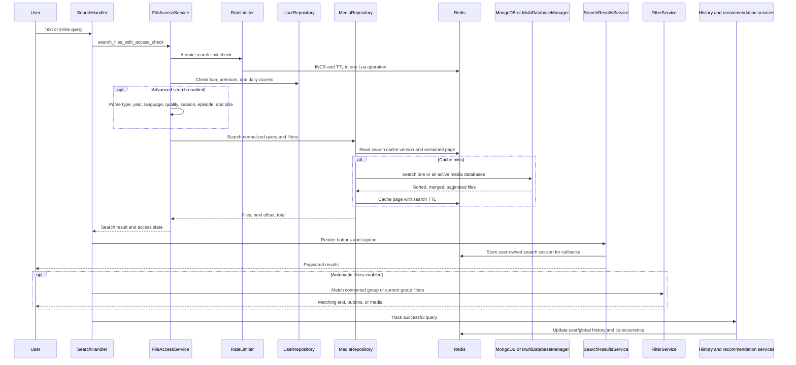
```mermaid
sequenceDiagram
    participant User
    participant Search as SearchHandler
    participant Access as FileAccessService
    participant Limit as RateLimiter
    participant UserRepo as UserRepository
    participant Media as MediaRepository
    participant Redis
    participant Mongo as MongoDB or MultiDatabaseManager
    participant Result as SearchResultsService
    participant Filter as FilterService
    participant History as History and recommendation services

    User->>Search: Text or inline query
    Search->>Access: search_files_with_access_check
    Access->>Limit: Atomic search limit check
    Limit->>Redis: INCR and TTL in one Lua operation
    Access->>UserRepo: Check ban, premium, and daily access
    opt Advanced search enabled
        Access->>Access: Parse type, year, language, quality, season, episode, and size
    end
    Access->>Media: Search normalized query and filters
    Media->>Redis: Read search cache version and versioned page
    alt Cache miss
        Media->>Mongo: Search one or all active media databases
        Mongo-->>Media: Sorted, merged, paginated files
        Media->>Redis: Cache page with search TTL
    end
    Media-->>Access: Files, next offset, total
    Access-->>Search: Search result and access state
    Search->>Result: Render buttons and caption
    Result->>Redis: Store user-owned search session for callbacks
    Result-->>User: Paginated results
    opt Automatic filters enabled
        Search->>Filter: Match connected group or current group filters
        Filter-->>User: Matching text, buttons, or media
    end
    Search->>History: Track successful query
    History->>Redis: Update user/global history and co-occurrence
```

No-result private searches query the same search history for fuzzy “Did you mean?” suggestions. Group searches deliberately avoid no-result noise.

## 5. File delivery and atomic quota reservation

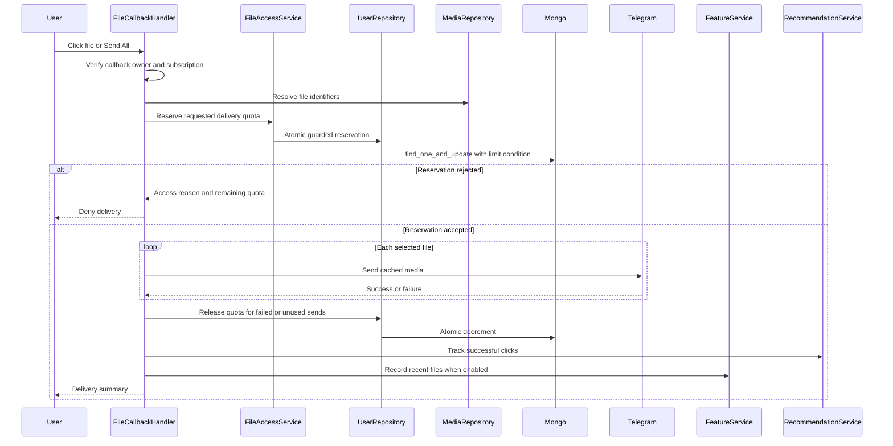
```mermaid
sequenceDiagram
    participant User
    participant Callback as FileCallbackHandler
    participant Access as FileAccessService
    participant UserRepo as UserRepository
    participant Media as MediaRepository
    participant Mongo
    participant Telegram
    participant Feature as FeatureService
    participant Recs as RecommendationService

    User->>Callback: Click file or Send All
    Callback->>Callback: Verify callback owner and subscription
    Callback->>Media: Resolve file identifiers
    Callback->>Access: Reserve requested delivery quota
    Access->>UserRepo: Atomic guarded reservation
    UserRepo->>Mongo: find_one_and_update with limit condition
    alt Reservation rejected
        Access-->>Callback: Access reason and remaining quota
        Callback-->>User: Deny delivery
    else Reservation accepted
        loop Each selected file
            Callback->>Telegram: Send cached media
            Telegram-->>Callback: Success or failure
        end
        Callback->>UserRepo: Release quota for failed or unused sends
        UserRepo->>Mongo: Atomic decrement
        Callback->>Recs: Track successful clicks
        Callback->>Feature: Record recent files when enabled
        Callback-->>User: Delivery summary
    end
```

Quota is reserved before bulk delivery and unused capacity is released afterward, preventing concurrent callbacks from exceeding a free-user limit.

## 6. Channel and manual indexing pipeline

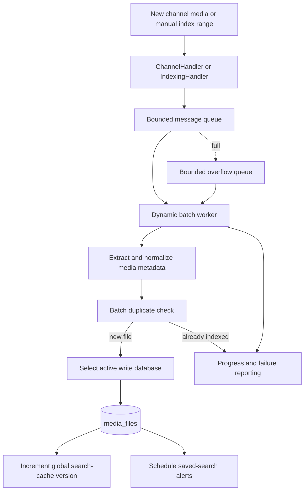
```mermaid
flowchart TB
    Update[New channel media or manual index range]
    Handler[ChannelHandler or IndexingHandler]
    MainQ[Bounded message queue]
    Overflow[Bounded overflow queue]
    Batch[Dynamic batch worker]
    Extract[Extract and normalize media metadata]
    Duplicate[Batch duplicate check]
    Router[Select active write database]
    Save[(media_files)]
    Invalidate[Increment global search-cache version]
    Alerts[Schedule saved-search alerts]
    Admin[Progress and failure reporting]

    Update --> Handler
    Handler --> MainQ
    MainQ -. full .-> Overflow
    MainQ --> Batch
    Overflow --> Batch
    Batch --> Extract
    Extract --> Duplicate
    Duplicate -->|new file| Router
    Duplicate -->|already indexed| Admin
    Router --> Save
    Save --> Invalidate
    Save --> Alerts
    Batch --> Admin
```

Batch size and wait time change with queue load. Indexing remains authoritative in MongoDB; saved-search notifications are scheduled after a successful save and cannot turn an indexing success into a failure.

## 7. Recommendations and similar keywords

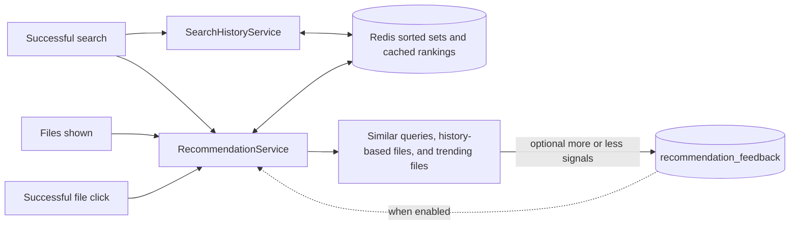
```mermaid
flowchart LR
    Query[Successful search]
    Results[Files shown]
    Click[Successful file click]
    History[SearchHistoryService]
    Rec[RecommendationService]
    Redis[(Redis sorted sets and cached rankings)]
    Feedback[(recommendation_feedback)]
    Output[Similar queries, history-based files, and trending files]

    Query --> History
    Query --> Rec
    Results --> Rec
    Click --> Rec
    History <--> Redis
    Rec <--> Redis
    Feedback -. when enabled .-> Rec
    Rec --> Output
    Output -->|optional more or less signals| Feedback
```

Query similarity first uses bidirectional co-occurrence and then fills gaps with RapidFuzz matching against user and global history. File recommendations combine query-to-file mappings, file co-occurrence, user interaction history, and global trends. Per-user recommendation output is cached for ten minutes and invalidated when new user signals arrive.

## 8. User-owned feature CRUD

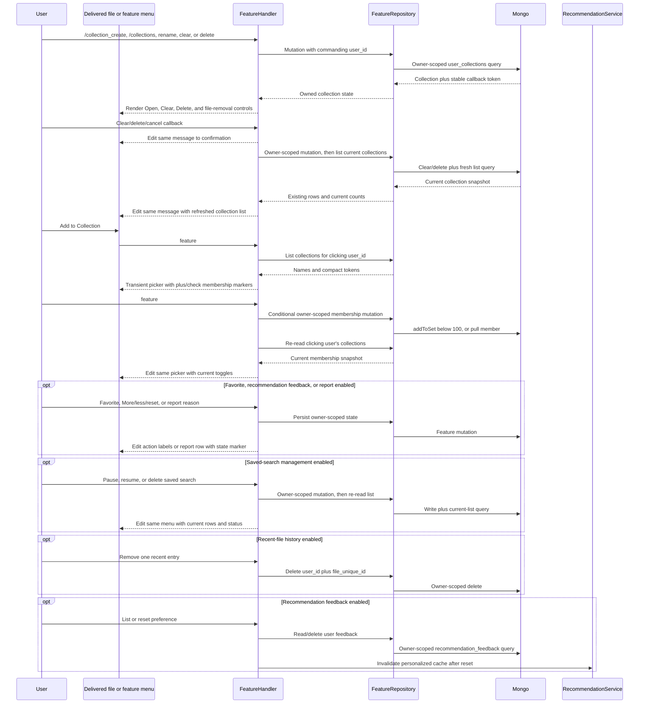
```mermaid
sequenceDiagram
    participant User
    participant Delivery as Delivered file or feature menu
    participant Handler as FeatureHandler
    participant Repo as FeatureRepository
    participant Mongo
    participant Recs as RecommendationService

    User->>Handler: /collection_create, /collections, rename, clear, or delete
    Handler->>Repo: Mutation with commanding user_id
    Repo->>Mongo: Owner-scoped user_collections query
    Mongo-->>Repo: Collection plus stable callback token
    Repo-->>Handler: Owned collection state
    Handler-->>Delivery: Render Open, Clear, Delete, and file-removal controls

    User->>Handler: Clear/delete/cancel callback
    Handler-->>Delivery: Edit same message to confirmation
    Handler->>Repo: Owner-scoped mutation, then list current collections
    Repo->>Mongo: Clear/delete plus fresh list query
    Mongo-->>Repo: Current collection snapshot
    Repo-->>Handler: Existing rows and current counts
    Handler-->>Delivery: Edit same message with refreshed collection list

    User->>Delivery: Add to Collection
    Delivery->>Handler: feature#col_pick#file_id
    Handler->>Repo: List collections for clicking user_id
    Repo-->>Handler: Names and compact tokens
    Handler-->>Delivery: Transient picker with plus/check membership markers
    User->>Handler: feature#col_add or col_remove#file_id#token
    Handler->>Repo: Conditional owner-scoped membership mutation
    Repo->>Mongo: addToSet below 100, or pull member
    Handler->>Repo: Re-read clicking user's collections
    Repo-->>Handler: Current membership snapshot
    Handler-->>Delivery: Edit same picker with current toggles

    opt Favorite, recommendation feedback, or report enabled
        User->>Handler: Favorite, More/less/reset, or report reason
        Handler->>Repo: Persist owner-scoped state
        Repo->>Mongo: Feature mutation
        Handler-->>Delivery: Edit action labels or report row with state marker
    end

    opt Saved-search management enabled
        User->>Handler: Pause, resume, or delete saved search
        Handler->>Repo: Owner-scoped mutation, then re-read list
        Repo->>Mongo: Write plus current-list query
        Handler-->>Delivery: Edit same menu with current rows and status
    end

    opt Recent-file history enabled
        User->>Handler: Remove one recent entry
        Handler->>Repo: Delete user_id plus file_unique_id
        Repo->>Mongo: Owner-scoped delete
    end

    opt Recommendation feedback enabled
        User->>Handler: List or reset preference
        Handler->>Repo: Read/delete user feedback
        Repo->>Mongo: Owner-scoped recommendation_feedback query
        Handler->>Recs: Invalidate personalized cache after reset
    end
```

Collection callbacks carry an eight-character stable token rather than a full
name or document ID. Repository lookups always combine that token with the
clicking `user_id`, and destructive callback operations require a confirmation.
Legacy collections derive the same token from their existing `_id`, so no data
migration is required. Interactive mutations follow a persist, re-read, and edit
cycle; best-effort Telegram edits never roll back an authoritative database
write. Saved searches expose create/list, pause-resume, and delete; their Run
action reuses the normal user-owned search session. Reports and content requests
are lifecycle/audit records and are resolved rather than hard-deleted by users.

## 9. Cache ownership and invalidation

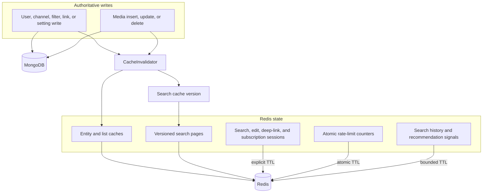
```mermaid
flowchart TB
    subgraph Writers[Authoritative writes]
        UserWrite[User, channel, filter, link, or setting write]
        MediaWrite[Media insert, update, or delete]
    end

    Mongo[(MongoDB)]
    Invalidator[CacheInvalidator]
    Version[Search cache version]

    subgraph RedisState[Redis state]
        Entity[Entity and list caches]
        SearchPage[Versioned search pages]
        Sessions[Search, edit, deep-link, and subscription sessions]
        Limits[Atomic rate-limit counters]
        Behavioral[Search history and recommendation signals]
    end

    Redis[(Redis)]

    UserWrite --> Mongo
    UserWrite --> Invalidator
    Invalidator --> Entity
    MediaWrite --> Mongo
    MediaWrite --> Invalidator
    Invalidator --> Version
    Version --> SearchPage
    Entity --> Redis
    SearchPage --> Redis
    Sessions -->|explicit TTL| Redis
    Limits -->|atomic TTL| Redis
    Behavioral -->|bounded TTL| Redis
```

- Search mutations invalidate in O(1) by incrementing `cache:search:version`; old pages expire naturally.
- Search result sessions use explicit TTLs, so maintenance does not purge still-live Telegram buttons.
- Cache serialization uses JSON or MessagePack, optionally compressed; pickle is retained only for legacy reads.
- MongoDB remains authoritative. Normal deployments should not flush Redis.

## 10. Configuration lifecycle

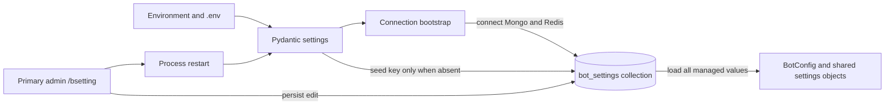
```mermaid
flowchart LR
    Env[Environment and .env]
    Typed[Pydantic settings]
    Bootstrap[Connection bootstrap]
    SettingsRepo[(bot_settings collection)]
    Runtime[BotConfig and shared settings objects]
    Admin[Primary admin /bsetting]
    Restart[Process restart]

    Env --> Typed
    Typed --> Bootstrap
    Bootstrap -->|connect Mongo and Redis| SettingsRepo
    Typed -->|seed key only when absent| SettingsRepo
    SettingsRepo -->|load all managed values| Runtime
    Admin -->|persist edit| SettingsRepo
    Admin --> Restart
    Restart --> Typed
```

Environment changes do not overwrite an existing Mongo-backed setting. Use `/bsetting`, then restart, for managed runtime settings. Keep Telegram credentials and database/Redis connection details in the deployment environment because they are required before settings synchronization.

## 11. Multi-database routing and circuit breaker

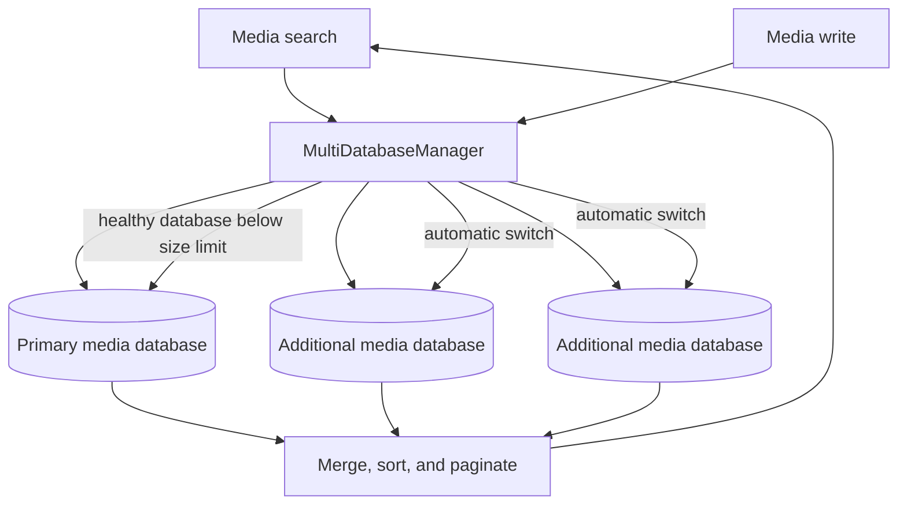
```mermaid
flowchart TB
    Search[Media search]
    Write[Media write]
    Manager[MultiDatabaseManager]
    D1[(Primary media database)]
    D2[(Additional media database)]
    D3[(Additional media database)]
    Merge[Merge, sort, and paginate]

    Search --> Manager
    Manager --> D1
    Manager --> D2
    Manager --> D3
    D1 --> Merge
    D2 --> Merge
    D3 --> Merge
    Merge --> Search
    Write --> Manager
    Manager -->|healthy database below size limit| D1
    Manager -->|automatic switch| D2
    Manager -->|automatic switch| D3
```

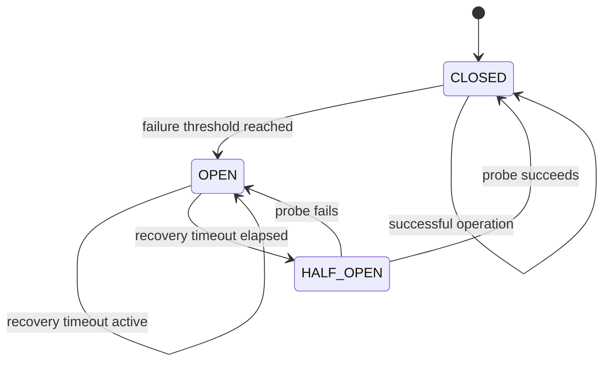
```mermaid
stateDiagram-v2
    [*] --> CLOSED
    CLOSED --> OPEN: failure threshold reached
    CLOSED --> CLOSED: successful operation
    OPEN --> OPEN: recovery timeout active
    OPEN --> HALF_OPEN: recovery timeout elapsed
    HALF_OPEN --> CLOSED: probe succeeds
    HALF_OPEN --> OPEN: probe fails
```

Only media data is distributed. User/control collections continue to use the primary database pool. An unhealthy media database is isolated by its circuit breaker while healthy databases remain searchable.

## 12. Core and additive data model

The relationships below are logical references; MongoDB does not enforce foreign keys.

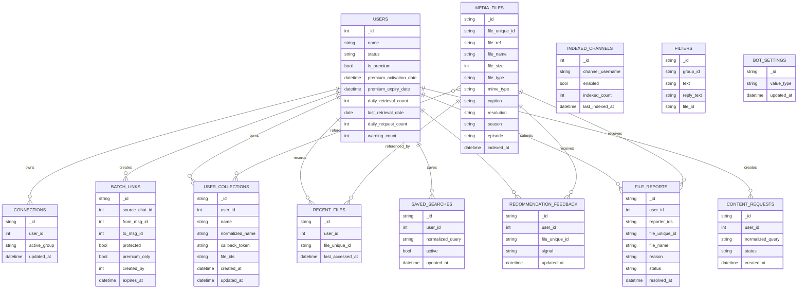
```mermaid
erDiagram
    USERS {
        int _id
        string name
        string status
        bool is_premium
        datetime premium_activation_date
        datetime premium_expiry_date
        int daily_retrieval_count
        date last_retrieval_date
        int daily_request_count
        int warning_count
    }

    MEDIA_FILES {
        string _id
        string file_unique_id
        string file_ref
        string file_name
        int file_size
        string file_type
        string mime_type
        string caption
        string resolution
        string season
        string episode
        datetime indexed_at
    }

    INDEXED_CHANNELS {
        int _id
        string channel_username
        bool enabled
        int indexed_count
        datetime last_indexed_at
    }

    CONNECTIONS {
        string _id
        int user_id
        string active_group
        datetime updated_at
    }

    FILTERS {
        string _id
        string group_id
        string text
        string reply_text
        string file_id
    }

    BATCH_LINKS {
        string _id
        int source_chat_id
        int from_msg_id
        int to_msg_id
        bool protected
        bool premium_only
        int created_by
        datetime expires_at
    }

    BOT_SETTINGS {
        string _id
        string value_type
        datetime updated_at
    }

    USER_COLLECTIONS {
        string _id
        int user_id
        string name
        string normalized_name
        string callback_token
        string file_ids
        datetime created_at
        datetime updated_at
    }

    RECENT_FILES {
        string _id
        int user_id
        string file_unique_id
        datetime last_accessed_at
    }

    SAVED_SEARCHES {
        string _id
        int user_id
        string normalized_query
        bool active
        datetime updated_at
    }

    RECOMMENDATION_FEEDBACK {
        string _id
        int user_id
        string file_unique_id
        string signal
        datetime updated_at
    }

    FILE_REPORTS {
        string _id
        int user_id
        string reporter_ids
        string file_unique_id
        string file_name
        string reason
        string status
        datetime resolved_at
    }

    CONTENT_REQUESTS {
        string _id
        int user_id
        string normalized_query
        string status
        datetime created_at
    }

    USERS ||--o{ CONNECTIONS : owns
    USERS ||--o{ BATCH_LINKS : creates
    USERS ||--o{ USER_COLLECTIONS : owns
    USERS ||--o{ RECENT_FILES : records
    USERS ||--o{ SAVED_SEARCHES : saves
    USERS ||--o{ RECOMMENDATION_FEEDBACK : submits
    USERS ||--o{ FILE_REPORTS : submits
    USERS ||--o{ CONTENT_REQUESTS : creates
    MEDIA_FILES }o--o{ USER_COLLECTIONS : referenced_by
    MEDIA_FILES ||--o{ RECENT_FILES : referenced_by
    MEDIA_FILES ||--o{ RECOMMENDATION_FEEDBACK : receives
    MEDIA_FILES ||--o{ FILE_REPORTS : receives
```

For an existing premium grant, `USERS.premium_expiry_date` is authoritative;
`PREMIUM_DURATION_DAYS` in `BOT_SETTINGS` is only the default for future grants.
Remaining days are derived by rounding positive time-to-expiry up, while daily
retrieval usage applies only when `last_retrieval_date` is today. Changing a
default setting never rewrites existing user grant dates.

Other additive collections include `saved_search_notifications` for alert deduplication and `search_analytics` for bounded zero-result analytics. Group filter documents are stored in `filters_<group_id>` collections, with `global_filters` used when no group is supplied.

## 13. Docker deployment topology

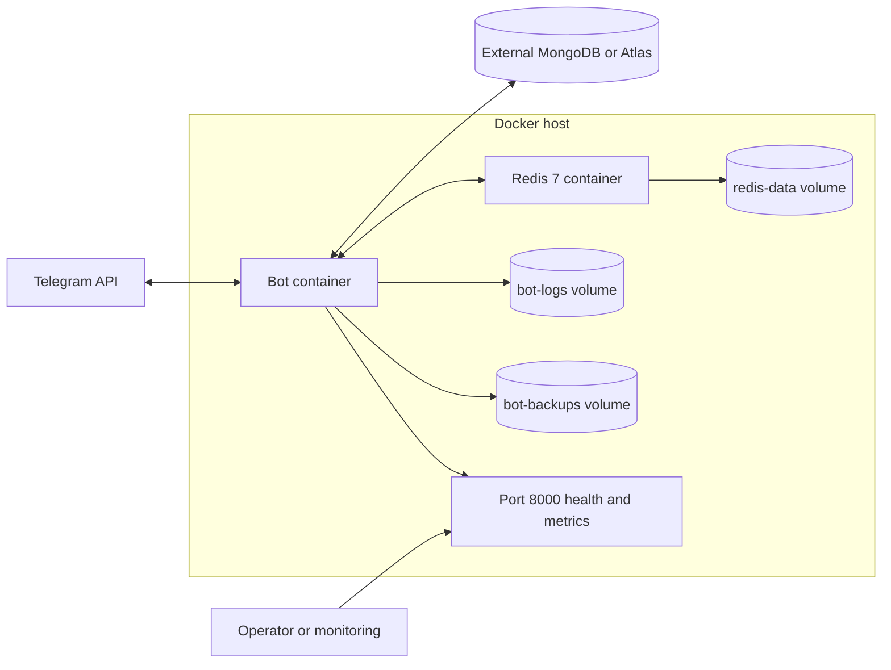
```mermaid
flowchart LR
    Telegram[Telegram API]
    Operator[Operator or monitoring]

    subgraph Host[Docker host]
        Bot[Bot container]
        Redis[Redis 7 container]
        HTTP[Port 8000 health and metrics]
        Logs[(bot-logs volume)]
        Data[(redis-data volume)]
        Backups[(bot-backups volume)]
    end

    Mongo[(External MongoDB or Atlas)]

    Telegram <--> Bot
    Bot <--> Mongo
    Bot <--> Redis
    Redis --> Data
    Bot --> Logs
    Bot --> Backups
    Bot --> HTTP
    Operator --> HTTP
```

Docker Compose supplies Redis internally as `redis://redis:6379/0` and exposes only the bot HTTP port. Run one bot process per Telegram bot token; multiple polling replicas for the same token can compete for updates.

## Maintenance rule

When code changes alter any boundary shown here, update the affected diagram in the same change. In particular, keep storage ownership, setting precedence, feature gates, and failure behavior aligned with the implementation.
